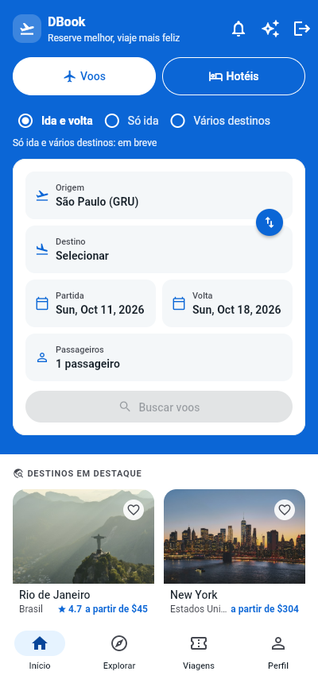
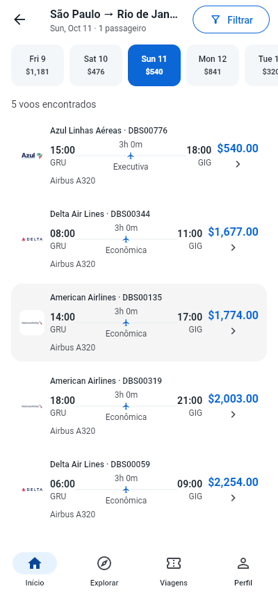
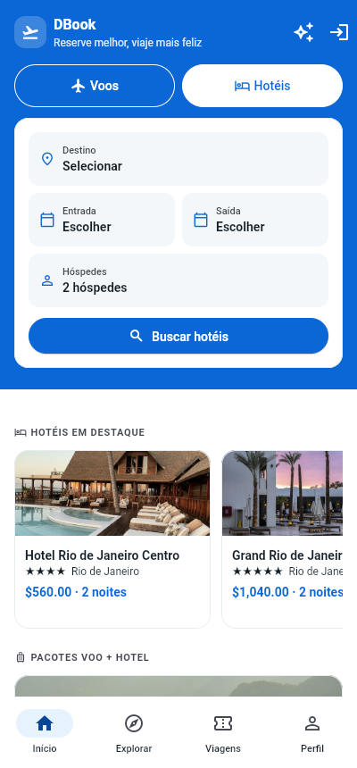
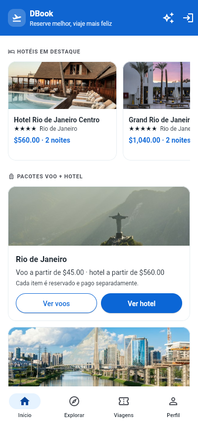
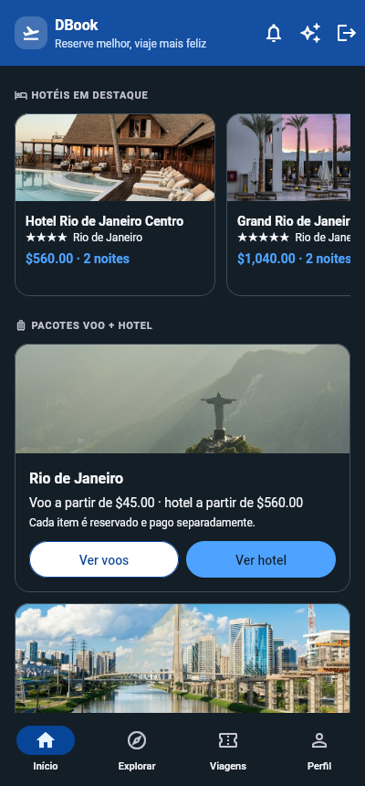
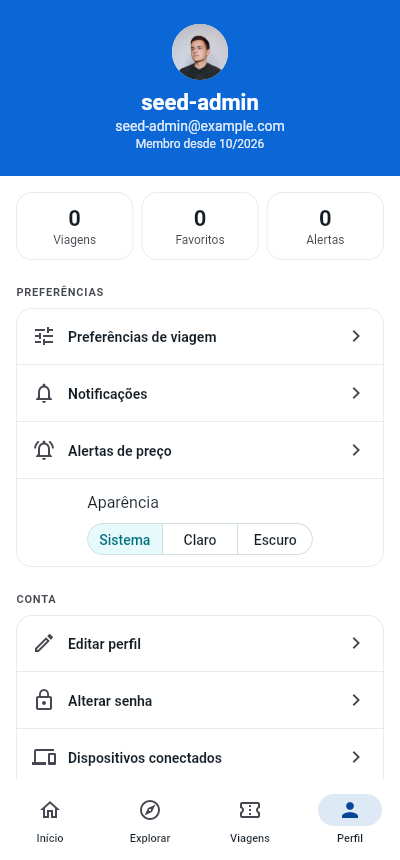
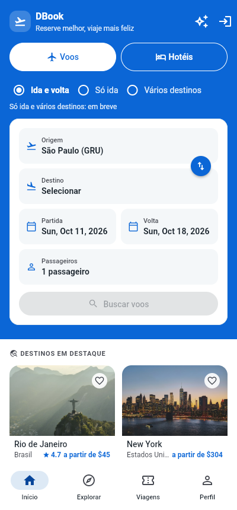
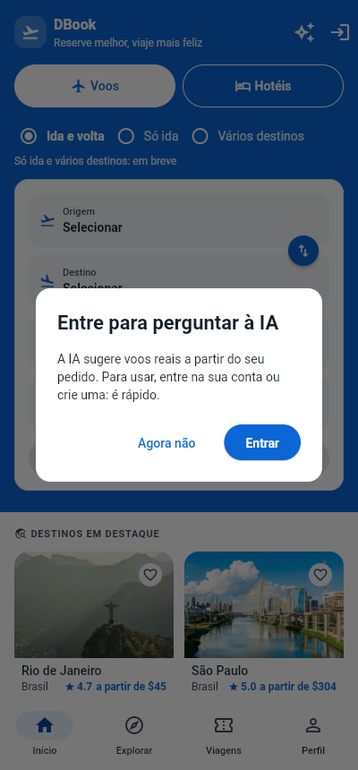
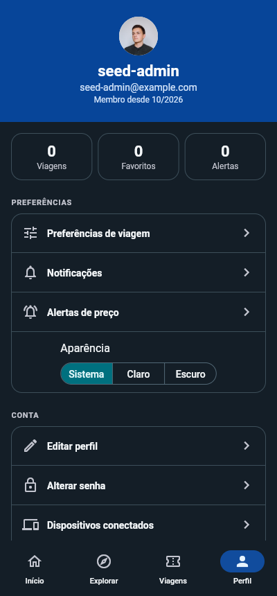

# DBook Mobile

Cliente Flutter do [DBook](../dbook) — consome a API de reservas de voos e hotéis construída no projeto backend. Inclui o app de clientes e o portal administrativo da equipe (Flutter Web).

Monorepo gerenciado com [melos](https://melos.invertase.dev/), sobre o suporte nativo do Dart a [pub workspaces](https://dart.dev/tools/pub/workspaces).

## Visão geral do app

O app de clientes (Flutter, web e mobile) busca voos e hotéis numa tela só, mostra a vitrine de hotéis e pacotes com fotos reais, reserva e paga, e guarda preferências na conta. Capturas contra a API real (400 × 860); a lista completa, com a descrição de cada uma, está em [`docs/screenshots`](docs/screenshots/README.md).

| Busca de voos | Resultados com logo da companhia | Detalhe do voo |
|---|---|---|
|  |  |  |

| Busca de hotéis | Vitrine de hotéis e pacotes | Tema escuro |
|---|---|---|
|  |  |  |

| Perfil | Preferências de viagem | Home com a origem da conta |
|---|---|---|
|  |  |  |

| Perguntar à IA | IA para visitante | Perfil no tema escuro |
|---|---|---|
|  |  |  |

## Estrutura

```
apps/
  dbook_mobile/                 # app Flutter de clientes (voos, hotéis, reserva, pagamento, perfil)
  dbook_admin/                  # portal administrativo (Flutter Web): clientes, reservas, catálogo, dashboard, equipe
packages/
  dbook_design_system/          # tokens, tema e componentes compartilhados
    sample/                     # app de exemplo mostrando o design system
    widgetbook/                 # catálogo visual (Widgetbook)
  dbook_domain/                 # entidades, portas e casos de uso — Dart puro
  dbook_core_network/           # Dio, DTOs e implementação dos repositórios — Dart puro
  dbook_core_storage/           # storage seguro do par de tokens (flutter_secure_storage)
  dbook_core_session/           # Dio autenticado (token + refresh automático), compartilhado por toda feature
  dbook_feature_auth/           # telas de login/cadastro e sessão (Riverpod)
  dbook_feature_flights/        # busca, resultados e detalhe de voo (Riverpod + go_router)
  dbook_feature_booking/        # seleção de assento, confirmação e minhas reservas (Riverpod)
  dbook_feature_realtime/       # disponibilidade ao vivo — cliente STOMP mínimo sobre WebSocket
  dbook_feature_ai/             # sugestão de voo por IA — busca em linguagem natural (Riverpod)
  dbook_feature_stays/          # busca de hotel, detalhe, quartos, reserva e minhas estadias
  dbook_feature_notifications/  # caixa de entrada, preferências de aviso e registro do aparelho
  dbook_admin_data/             # portal: modelos tolerantes e APIs administrativas
  dbook_admin_session/          # portal: sessão em memória, ociosidade, rascunho protegido, permissões
  dbook_admin_l10n/             # portal: textos em português e formatação
  dbook_feature_admin_*/        # portal: auth, equipe, clientes, reservas, catálogo, dashboard, governança
```

## Rodando localmente

Resolver o workspace inteiro a partir da raiz:

```bash
flutter pub get
```

Scripts do melos (rodam em todos os pacotes do workspace):

```bash
melos run analyze       # flutter analyze (todos os pacotes)
melos run format        # dart format --set-exit-if-changed . (todos os pacotes)
melos run test          # flutter test (pacotes Flutter com pasta test/)
melos run test:dart     # dart test (pacotes Dart puro com pasta test/ — dbook_domain, dbook_core_network)
melos run coverage      # flutter test --coverage (pacotes Flutter)
melos run coverage:dart # dart test --coverage + conversão pra lcov (pacotes Dart puro)
```

`dbook_domain`/`dbook_core_network` (entidades/DTOs) e as features com estado `freezed` usam codegen; os arquivos gerados são versionados. Depois de mexer neles, rodar `dart run build_runner build` dentro do pacote (a flag `--delete-conflicting-outputs` foi removida desta versão do build_runner) dentro do pacote — os `.freezed.dart`/`.g.dart` ficam versionados (sem passo de codegen no CI).

Rodar cada app individualmente:

```bash
cd apps/dbook_mobile && flutter run            # app de clientes (precisa do backend em :8080)
cd apps/dbook_admin && flutter run -d chrome   # portal administrativo
cd packages/dbook_design_system/sample && flutter run
cd packages/dbook_design_system/widgetbook && flutter run
```

Teste instrumentado (precisa de device/emulador real):

```bash
cd apps/dbook_mobile && flutter test integration_test/app_test.dart
```

## CI/CD

`.github/workflows/ci.yml` roda em todo push/PR pra `main`:

- **`analyze-format-test`** — `melos run analyze` + `format` + `coverage`/`coverage:dart`, gate de cobertura mínima 80% (`very_good_coverage`). Esse é o check que o branch protection do GitHub exige antes de mergear.
- **`build-android`** — builda um APK debug (sempre) e um APK release. O release é assinado com o keystore de verdade se os secrets `ANDROID_KEYSTORE_BASE64`/`ANDROID_KEYSTORE_PASSWORD`/`ANDROID_KEY_ALIAS`/`ANDROID_KEY_PASSWORD` existirem no repo; sem eles, cai pra assinatura de debug (nunca quebra o build).
- **`build-ios`** — `flutter build ios --release --no-codesign` num runner `macos-latest`. Sem certificado/perfil de provisionamento da Apple Developer Program configurado, só valida que o app compila e arquiva — não gera um `.ipa` assinado de verdade.

### Assinatura de release (Android)

`apps/dbook_mobile/android/app/build.gradle.kts` lê `android/key.properties` (nunca commitado — já está no `.gitignore` do template do Flutter) se existir; senão, o release cai pra assinatura de debug. Pra assinar de verdade:

**Local:** copie `android/key.properties.example` pra `android/key.properties`, gere um keystore com `keytool -genkeypair` e preencha as senhas.

**CI:** cadastre os 4 secrets no repo (`gh secret set ANDROID_KEYSTORE_BASE64 < keystore.jks.base64`, etc., ou pela UI do GitHub em Settings → Secrets and variables → Actions).

## Progresso

O detalhamento marco a marco, com decisões, achados e medições, está no [CHECKLIST.md](CHECKLIST.md). Resumo do estado:

| Marcos | O que entregaram | Estado |
|---|---|---|
| M1-M8 | Monorepo e design system, domínio e rede, autenticação, busca de voos, reserva e assento, tempo real (STOMP), sugestão por IA e CI/CD | ✅ |
| M9-M23 | Navegação com Auth Gate, resultados ricos, destinos reais, perfil, assento por modelo de avião, Minhas Viagens, Round Trip real, revisão e pagamento, avaliações, idempotência e API versionada | ✅ |
| M24-M25 | Fundações do portal: enums tolerantes, papéis e permissões, tokens de desktop e componentes de dados do design system | ✅ |
| M26-M36 | Portal administrativo (equipe, clientes, reservas e reembolso, catálogo, dashboard, auditoria, moderação, promoções, segurança, qualidade e deploy) | ✅ implementado e testado; E2E só no CI, deploy não executado |
| M37-M44 | App: notificações, destino e avaliações, favoritos no servidor, cupom no pagamento, alerta de preço, reembolso e privacidade, hotéis, versão mínima da API | ✅ |
| M45-M46 | Revisão do cliente: contraste e fonte, busca única de voo e hotel, vitrine de hotéis e pacotes, Trips unificada, interface em português | ✅ |
| M47-M48 | Logo da companhia, foto de hotel e de cidade, perfil completo (foto, preferências, senha, dispositivos) | ✅ app e campo de logo no portal; **faltam** a tela de hotéis do portal (47.3) e a foto no formulário de aeroportos (47.4) |

Qualidade: `melos run analyze` limpo, cobertura combinada de 80,68 % (portão do CI: 80 %). O backend correspondente está em [`../dbook`](../dbook).
